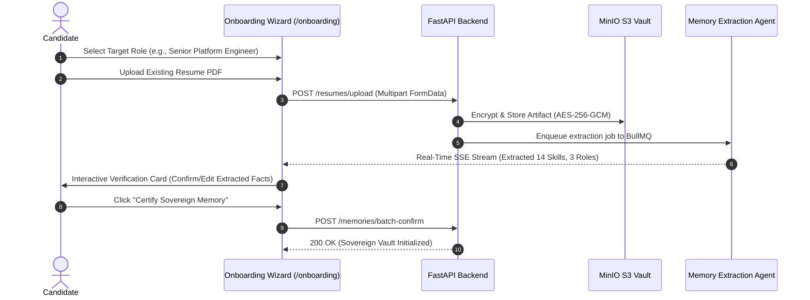
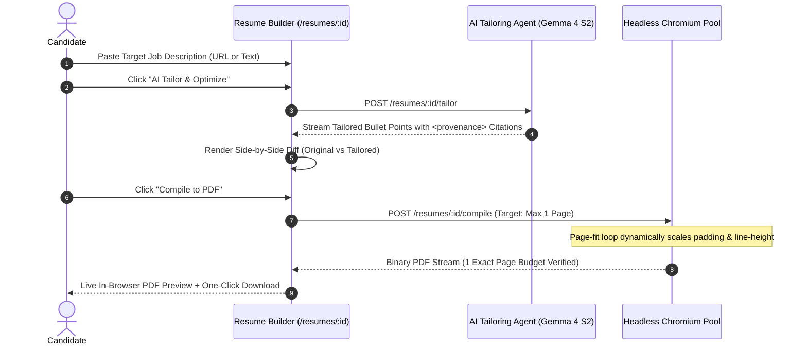
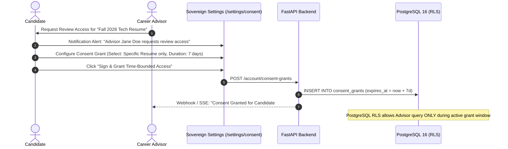

# ENT-P09 — 01 Information Architecture & User Journeys

> **Phase:** `ENT-P09` (UI/UX and Design System)  
> **Deliverable:** `DEL-ENT-P09-01` (v1.0)  
> **Owner:** Principal UX Architect & Product Design Lead  
> **Date:** 2026-09-29 | **Commit:** HEAD (`592db98e`)

---

## 1. Dual-Experience Architectural Framework

To honor candidate data sovereignty while providing powerful governance tools
for institutions, Vaeloom establishes two distinct, isolated visual and
navigational experiences:

```
┌────────────────────────────────────────────────────────────────────────┐
│                        VAELOOM USER INTERFACE                          │
├───────────────────────────────────┬────────────────────────────────────┤
│   CANDIDATE SOVEREIGN VAULT UX    │   INSTITUTIONAL CONTROL PLANE UX   │
│  - Tone: Empowering, Focused, Warm│  - Tone: Analytical, Dense, Crisp  │
│  - Purpose: Career Growth & Agency│  - Purpose: Governance & Oversight │
│  - Persona: Students, Job Seekers │  - Persona: Career Directors, Admins│
│  - Palette: Indigo, Slate, Emerald│  - Palette: Navy, Zinc, Amber      │
│  - Data Boundary: Private by def. │  - Data Boundary: Aggregate / Grant│
└───────────────────────────────────┴────────────────────────────────────┘
```

---

## 2. Global Site Map & Navigational Hierarchy

```mermaid
graph TD
    Root[Global Gateway /] --> Pub[Public Surface]
    Root --> AuthFlow[Auth / SSO Gateway]
    Root --> App[Authenticated Application]

    Pub --> Land[Landing Page /]
    Pub --> Pricing[Pricing & Plans]
    Pub --> Templates[Public Template Gallery]

    AuthFlow --> Login[Login / SSO Callback]
    AuthFlow --> Signup[Candidate Registration]
    AuthFlow --> MFA[TOTP / WebAuthn Challenge]

    App --> CandApp[Candidate Sovereign Portal]
    App --> InstApp[Institutional Admin Portal]

    subgraph CandidatePortal["Candidate Sovereign Portal (/workspace/:id)"]
        CandApp --> Dash[Overview & Quick Actions]
        CandApp --> Resumes[Resume Builder & Live Preview]
        CandApp --> Jobs[Job Match & Market Tracker]
        CandApp --> Chat[AI Career Coaching Stream]
        CandApp --> Mem[22-Type Cognitive Memories]
        CandApp --> Council[Multi-Agent Advisory Council]
        CandApp --> VaultSettings[Sovereign Vault & Consent Grants]
    end

    subgraph InstitutionalPortal["Institutional Admin Portal (/admin)"]
        InstApp --> InstDash[Cohort Metrics & Placement KPIs]
        InstApp --> Members[Roster Management & SCIM Groups]
        InstApp --> Advisors[Advisor Role Delegation]
        InstApp --> Audit[Partitioned Agent Audit Logs]
        InstApp --> Billing[Seat Licensing & Quota Allocation]
    end
```



---

## 3. End-to-End Core User Journeys

### Journey 1: Candidate Sovereign Onboarding & Resume Ingestion



### Journey 2: AI Agent Resume Tailoring with Grounded Provenance & Live PDF Fit



### Journey 3: Candidate Granular Consent Grant to Institutional Career Advisor



---

_Signed: Principal UX Architect & Product Design Lead — 2026-09-29_
