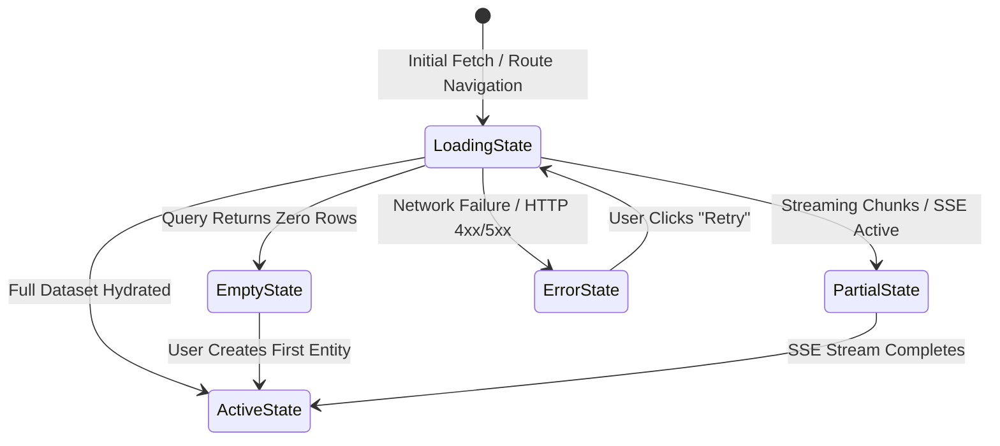

# ENT-P09 — 02 Screen & State Specifications

> **Phase:** `ENT-P09` (UI/UX and Design System)  
> **Deliverable:** `DEL-ENT-P09-02` (v1.0)  
> **Owner:** Lead Product Designer & Frontend Architecture Specialist  
> **Date:** 2026-09-29 | **Commit:** HEAD (`592db98e`)

---

## 1. Eight Core Application Surfaces

The Vaeloom Enterprise UI comprises eight primary application surfaces, each
engineered with strict accessibility, responsive behavior, and clear visual
hierarchy:

| Surface ID | Surface Name             | Primary Route                | Key User Actions & Interfaces                                                  |
| :--------- | :----------------------- | :--------------------------- | :----------------------------------------------------------------------------- |
| **SRF-01** | Landing & Hero Surface   | `/`                          | Value proposition, feature showcase, interactive ATS teaser, CTA routing.      |
| **SRF-02** | Candidate Onboarding     | `/onboarding`                | Stepper wizard, role preferences, PDF resume dropzone, memory preview.         |
| **SRF-03** | Sovereign Dashboard      | `/workspace/:id/overview`    | Quick actions, active resume cards, target job matches, advisory suggestions.  |
| **SRF-04** | Resume Builder & Preview | `/workspace/:id/resumes/:id` | Section editor, AI tailor modal, page-fit gauge, live Playwright PDF preview.  |
| **SRF-05** | Cognitive AI Chat        | `/workspace/:id/chat`        | Streaming ReAct thoughts, citation cards, interactive tool approval prompts.   |
| **SRF-06** | Memory Knowledge Graph   | `/workspace/:id/memory`      | 22-memory type filters, vector similarity score, source document audit links.  |
| **SRF-07** | Multi-Agent Council      | `/workspace/:id/council`     | 28-agent roster selector, agent debate feed, HITL destructive action approval. |
| **SRF-08** | Institutional Admin      | `/admin/*`                   | Multi-tenant organization settings, SCIM sync, partitioned audit log search.   |

---

## 2. Mandatory Five-State UI Architecture

Every application component and page surface strictly implements five
deterministic UI states:



### State Specifications & Accessibility Requirements:

1. **Loading State:**
   - Skeleton shimmer primitives rendered matching exact dimensions of target
     content.
   - Root container carries `aria-busy="true"` and `aria-live="polite"` to alert
     assistive screen readers.
2. **Empty State:**
   - Centered, contextual SVG illustration with zero layout shift.
   - Clear explanatory title, empathetic microcopy, and a prominent primary
     action CTA (e.g., "Create Your First Resume").
3. **Partial / In-Progress State:**
   - Streaming text animation with progressive card expansion for Server-Sent
     Events (SSE).
   - Real-time page-fit percentage indicator during Playwright Chromium document
     compilation.
4. **Active / Loaded State:**
   - Fully interactive tables, rich text inputs, and visual charts.
   - Immediate optimistic UI updates with background rollback on mutation
     failure.
5. **Error / Offline State:**
   - RFC 7807 Problem Details mapped to conversational, non-technical recovery
     messages.
   - Primary "Retry Action" button with keyboard focus auto-management;
     secondary "Contact Support" link.

---

## 3. Responsive Breakpoint Matrix & Overflow Invariants

Vaeloom enforces strict responsive layout behavior guaranteeing zero horizontal
overflow across all device viewports:

| Viewport Category      | Screen Width Range | Layout Adaptation                                                          |    Playwright Assertion     |
| :--------------------- | :----------------: | :------------------------------------------------------------------------- | :-------------------------: |
| **Mobile Extra Small** |  `320px – 374px`   | Single-column stack, collapsible bottom navigation, full-width modals.     | **0px Horizontal Overflow** |
| **Mobile Standard**    |  `375px – 414px`   | Single-column stack, touch-optimized $44\text{px}$ button targets.         | **0px Horizontal Overflow** |
| **Tablet Portrait**    |  `640px – 768px`   | 2-Column responsive grid, collapsible sidebar drawer.                      | **0px Horizontal Overflow** |
| **Desktop Standard**   | `1024px – 1439px`  | 3-Column layout (Left Nav, Main Editor/Feed, Right Inspector/Preview).     | **0px Horizontal Overflow** |
| **Large Enterprise**   |     `1440px +`     | Max-width content container ($1280\text{px}$) with centered visual margin. | **0px Horizontal Overflow** |

### Verified Overflow Test Logic (`apps/web/e2e/quality.spec.ts`):

```typescript
test('guarantees 0px horizontal scroll overflow across all responsive viewports', async ({
  page,
}) => {
  const viewports = [320, 375, 414, 768, 1024, 1440];
  for (const width of viewports) {
    await page.setViewportSize({ width, height: 800 });
    await page.goto('/workspace/default/overview');
    const scrollWidth = await page.evaluate(
      () => document.documentElement.scrollWidth,
    );
    const clientWidth = await page.evaluate(
      () => document.documentElement.clientWidth,
    );
    expect(scrollWidth).toBeLessThanOrEqual(clientWidth); // Zero horizontal overflow
  }
});
```

---

_Signed: Lead Product Designer & Frontend Architecture Specialist — 2026-09-29_
