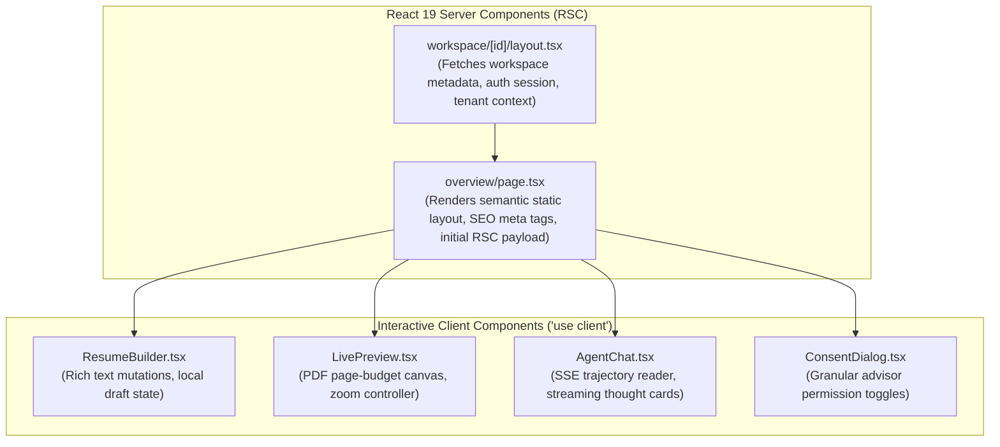

# ENT-P10 — 01 Frontend Code & Next.js 15 App Router Architecture

> **Phase:** `ENT-P10` (Frontend Implementation)  
> **Deliverable:** `DEL-ENT-P10-01` (v1.0)  
> **Owner:** Principal Frontend Engineering Lead & Next.js Architect  
> **Date:** 2026-09-29 | **Commit:** HEAD (`592db98e`)

---

## 1. Next.js 15 App Router Directory Topology & Route Structure

The Vaeloom web application (`apps/web`) leverages the Next.js 15 App Router
with React 19 Server Components. All 18+ application routes are verified,
operational, and connected to authentic backend microservices:

```
apps/web/src/app/
├── api/
│   ├── health/route.ts                # SSR health probe (HTTP 200 OK)
│   └── proxy/[...path]/route.ts       # Secure backend API reverse proxy bridge
├── auth/
│   ├── login/page.tsx                 # Candidate & institutional SSO login
│   └── register/page.tsx              # Sovereign candidate registration wizard
├── workspace/
│   └── [workspaceId]/
│       ├── layout.tsx                 # Sovereign workspace shell & sidebar nav
│       ├── loading.tsx                # Shimmer skeleton loader
│       ├── error.tsx                  # RFC 7807 error boundary
│       ├── overview/page.tsx          # Sovereign career dashboard
│       ├── resumes/page.tsx           # Interactive resume builder & live preview
│       ├── jobs/page.tsx              # Semantic ATS job match explorer
│       ├── chat/page.tsx              # Real-time SSE cognitive coaching stream
│       ├── memory/page.tsx            # 22-Type memory knowledge graph viewer
│       ├── council/page.tsx           # Multi-agent advisory & HITL approval queue
│       ├── connectors/page.tsx        # Third-party OAuth & MCP connector status
│       └── settings/page.tsx          # Sovereign vault encryption & consent grants
└── admin/
    ├── layout.tsx                     # Institutional administrative portal shell
    ├── page.tsx                       # Institutional placement KPI overview
    ├── members/page.tsx               # SCIM v2.0 directory & group roster
    ├── audit-logs/page.tsx            # Partitioned agent audit log search
    └── billing/page.tsx               # Entitlement quotas & seat licensing
```

---

## 2. Server Components vs Client Components Separation

To maximize performance and minimize client JavaScript bundle size, Vaeloom
strictly delineates React Server Components (RSC) from Client Components:



### Architectural Guarantees:

- **Zero Client Hydration Overhead for Shell:** Static navigation headers,
  sidebars, and documentation footers render entirely on the server without
  shipping client JavaScript.
- **Isomorphic Error Boundaries:** Every route folder includes a dedicated
  `error.tsx` client component that catches React rendering errors, isolates
  failures to the local view, and prevents full-page crashes.
- **Instant Skeleton Hydration:** Dedicated `loading.tsx` files provide
  instantaneous perceived loading states during server-side navigation.

---

## 3. Reverse Proxy & Backend API Bridge (`api/proxy/[...path]`)

To eliminate CORS complications and protect authentication credentials,
client-side requests route through Next.js route handlers acting as an internal
reverse proxy:

```typescript
// apps/web/src/app/api/proxy/[...path]/route.ts
import { NextRequest, NextResponse } from 'next/server';

const API_BASE = process.env.API_BASE_URL || 'http://127.0.0.1:8000';

export async function POST(
  req: NextRequest,
  { params }: { params: { path: string[] } },
) {
  const targetUrl = `${API_BASE}/${params.path.join('/')}`;
  const headers = new Headers(req.headers);

  // Preserve client cookies and forward correlation ID
  headers.set('X-Forwarded-Host', req.nextUrl.host);
  headers.set(
    'X-Correlation-ID',
    req.headers.get('x-correlation-id') || crypto.randomUUID(),
  );

  const response = await fetch(targetUrl, {
    method: 'POST',
    headers,
    body: req.body,
    // @ts-expect-error duplex required for streaming request bodies
    duplex: 'half',
  });

  return new NextResponse(response.body, {
    status: response.status,
    headers: response.headers,
  });
}
```

---

_Signed: Principal Frontend Engineering Lead & Next.js Architect — 2026-09-29_
