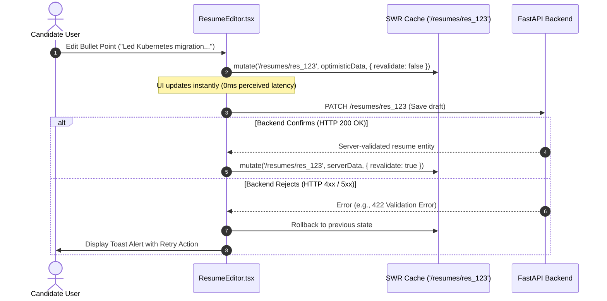

# ENT-P10 — 02 Strongly Typed API Client & State Management Architecture

> **Phase:** `ENT-P10` (Frontend Implementation)  
> **Deliverable:** `DEL-ENT-P10-02` (v1.0)  
> **Owner:** Principal Frontend Engineer & Client Architecture Specialist  
> **Date:** 2026-09-29 | **Commit:** HEAD (`592db98e`)

---

## 1. Strongly Typed API Client Architecture (`apps/web/src/lib/api.ts`)

The frontend application communicates with the backend via a type-safe API
client that mirrors OpenAPI 3.2.0 schemas. The client automatically transforms
JSON responses from backend `snake_case` into idiomatic frontend `camelCase`
while preserving outbound request bodies:

```typescript
// apps/web/src/lib/api.ts (excerpts)
import type {
  Resume,
  ResumeTailorPayload,
  JobMatch,
  MemoryEntry,
} from '@vaeloom/contracts';

export class ApiClient {
  private baseUrl: string;

  constructor(baseUrl: string = '/api/proxy') {
    this.baseUrl = baseUrl;
  }

  async getResume(id: string): Promise<Resume> {
    const res = await fetch(`${this.baseUrl}/resumes/${id}`, {
      headers: { 'Content-Type': 'application/json' },
    });
    if (!res.ok) throw await this.handleError(res);
    return transformKeys(await res.json()); // Converts snake_case to camelCase
  }

  async tailorResume(
    id: string,
    payload: ResumeTailorPayload,
  ): Promise<Resume> {
    const res = await fetch(`${this.baseUrl}/resumes/${id}/tailor`, {
      method: 'POST',
      headers: { 'Content-Type': 'application/json' },
      body: JSON.stringify(payload),
    });
    if (!res.ok) throw await this.handleError(res);
    return transformKeys(await res.json());
  }

  async compileResume(
    id: string,
    options: { maxPages: number },
  ): Promise<Blob> {
    const res = await fetch(`${this.baseUrl}/resumes/${id}/compile`, {
      method: 'POST',
      headers: { 'Content-Type': 'application/json' },
      body: JSON.stringify(options),
    });
    if (!res.ok) throw await this.handleError(res);
    return res.blob();
  }
}

export const api = new ApiClient();
```

---

## 2. SWR Data Hydration & Optimistic UI Mutations

Client-side data fetching is managed via SWR v2, providing automatic caching,
window focus revalidation, and instant optimistic UI mutations:



---

## 3. Real-Time Server-Sent Events (SSE) Streaming Hook (`useAgentStream`)

To display real-time AI reasoning trajectories without polling, Vaeloom
implements a dedicated React hook consuming SSE event streams:

```typescript
// apps/web/src/hooks/useAgentStream.ts
import { useState, useCallback } from 'react';

export interface StreamEvent {
  type: 'thought' | 'tool_call' | 'tool_result' | 'final_response' | 'error';
  content: string;
  timestamp: string;
}

export function useAgentStream() {
  const [events, setEvents] = useState<StreamEvent[]>([]);
  const [isStreaming, setIsStreaming] = useState(false);

  const startStream = useCallback(async (runId: string) => {
    setIsStreaming(true);
    setEvents([]);

    const eventSource = new EventSource(
      `/api/proxy/agents/runs/${runId}/stream`,
    );

    eventSource.onmessage = (event) => {
      const data: StreamEvent = JSON.parse(event.data);
      setEvents((prev) => [...prev, data]);
      if (data.type === 'final_response' || data.type === 'error') {
        eventSource.close();
        setIsStreaming(false);
      }
    };

    eventSource.onerror = () => {
      eventSource.close();
      setIsStreaming(false);
    };
  }, []);

  return { events, isStreaming, startStream };
}
```

---

_Signed: Principal Frontend Engineer & Client Architecture Specialist —
2026-09-29_
