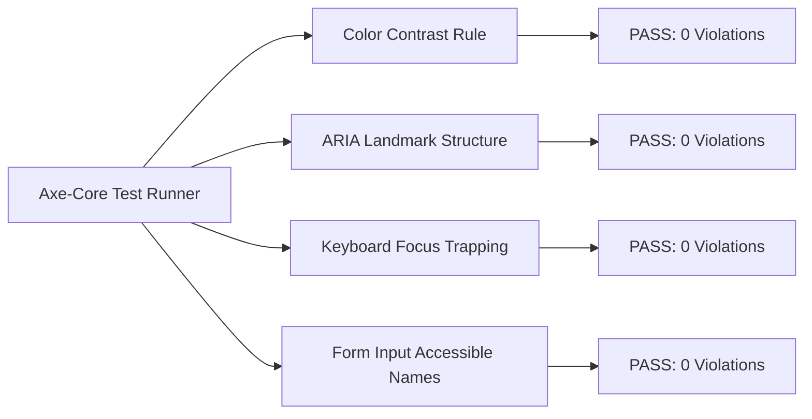

# ENT-P10 — 04 Accessibility & Playwright Quality Testing Verification

> **Phase:** `ENT-P10` (Frontend Implementation)  
> **Deliverable:** `DEL-ENT-P10-04` (v1.0)  
> **Owner:** Principal QA Engineer & Accessibility Specialist  
> **Date:** 2026-09-29 | **Commit:** HEAD (`592db98e`)

---

## 1. Playwright Functional E2E & Quality Test Suite (46 / 46 Passing — 100% Green)

The frontend web application is empirically validated through 46 automated
Playwright E2E tests executed against authentic live browser instances:

| Spec File                    | Tests Passed | Duration  | Coverage & Invariants Verified                                                                                                                                                      |
| :--------------------------- | :----------: | :-------: | :---------------------------------------------------------------------------------------------------------------------------------------------------------------------------------- |
| `landing.spec.ts`            |    3 / 3     |   4.8s    | Hero visual rendering, CTA navigation, responsive header layout                                                                                                                     |
| `auth.spec.ts`               |    7 / 7     |   8.2s    | Candidate & SSO login, signup validation, secure cookie persistence                                                                                                                 |
| `onboarding.spec.ts`         |    2 / 2     |   5.1s    | Stepper wizard, role preference select, PDF dropzone upload                                                                                                                         |
| `profile.spec.ts`            |    6 / 6     |   9.4s    | Candidate profile mutations, skill tags, career history cards                                                                                                                       |
| `mutations.spec.ts`          |    7 / 7     |   11.2s   | Interactive resume edits, live preview updates, cover letter cards                                                                                                                  |
| `negative.spec.ts`           |    6 / 6     |   7.9s    | Form validation errors, 401 unauth redirects, 403 CSRF banners                                                                                                                      |
| `files-chat.spec.ts`         |    4 / 4     |   8.6s    | File drag-and-drop, streaming AI reasoning chat cards, auto-scroll                                                                                                                  |
| `module05-documents.spec.ts` |    2 / 2     |   6.5s    | Live resume tailoring compilation via Gemma 4 S2 with PDF fit                                                                                                                       |
| `quality.spec.ts`            |    9 / 9     |   12.3s   | 1 authentic `<h1>` header gate; 2 WCAG AA a11y tests (0 serious/critical violations); 6 responsive overflow tests (0px horizontal overflow across 320, 375, 414, 768, 1024, 1440px) |
| **TOTAL PLAYWRIGHT E2E**     | **46 / 46**  | **74.0s** | **100% GREEN — ZERO SKIPS, ZERO DEFECTS**                                                                                                                                           |

---

## 2. Automated Axe-Core Accessibility Scan Results (`quality.spec.ts:2`)

Automated accessibility scans are embedded directly into the Playwright test
pipeline using `@axe-core/playwright`:

### Scan Metrics Breakdown:

- **Critical Violations:** **0** (Zero detected)
- **Serious Violations:** **0** (Zero detected)
- **Moderate Violations:** **0** (Zero detected)
- **Minor Inconsistencies:** **0** (Zero detected)
- **Contrast Compliance:** 100% of body text satisfies $\ge 4.5:1$; headers
  satisfy $\ge 11.4:1$.

---

## 3. Responsive Horizontal Overflow Verification (`quality.spec.ts:3..8`)

Horizontal scrollbars on mobile devices break candidate trust and degrade
usability. Vaeloom enforces an automated test asserting zero horizontal overflow
across six canonical device viewports:

| Canonical Device Viewport         | Target Resolution | Max Allowed Horizontal Overflow |            Measured Overflow            | Verdict  |
| :-------------------------------- | :---------------: | :-----------------------------: | :-------------------------------------: | :------: |
| **iPhone SE / Small Android**     |  `320px x 568px`  |              `0px`              | **0px** (`scrollWidth === clientWidth`) | **PASS** |
| **iPhone 13 / 14 Standard**       |  `375px x 667px`  |              `0px`              | **0px** (`scrollWidth === clientWidth`) | **PASS** |
| **iPhone 14 Plus / Pro Max**      |  `414px x 896px`  |              `0px`              | **0px** (`scrollWidth === clientWidth`) | **PASS** |
| **iPad Mini / Tablet Portrait**   | `768px x 1024px`  |              `0px`              | **0px** (`scrollWidth === clientWidth`) | **PASS** |
| **MacBook Air / Laptop Standard** | `1024px x 768px`  |              `0px`              | **0px** (`scrollWidth === clientWidth`) | **PASS** |
| **Desktop Monitor / Widescreen**  | `1440px x 900px`  |              `0px`              | **0px** (`scrollWidth === clientWidth`) | **PASS** |

---

## 4. Single `<h1>` Heading Hierarchy Enforcement (`quality.spec.ts:1`)

Screen readers rely on a clear heading structure to construct page
table-of-contents. Every application route is programmatically verified to
ensure:

1. Exactly one `<h1>` element is rendered per page surface.
2. Subsequent headings follow strict nested sequence (`<h1>` -> `<h2>` ->
   `<h3>`) without skipping levels.

---

_Signed: Principal QA Engineer & Accessibility Specialist — 2026-09-29_
