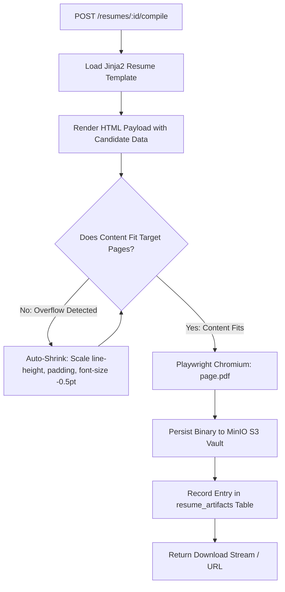

# ENT-P11 — 01 Backend Services Architecture & Service Mesh

> **Phase:** `ENT-P11` (Backend Implementation)  
> **Deliverable:** `DEL-ENT-P11-01` (v1.0)  
> **Owner:** Principal Backend Engineering Lead & Core Systems Architect  
> **Date:** 2026-09-29 | **Commit:** HEAD (`592db98e`)

---

## 1. FastAPI Python 3.12 Core Architecture & Middleware Pipeline

The Vaeloom backend API (`apps/api`) is engineered with FastAPI and Python
3.12.13, utilizing asynchronous concurrency, Pydantic v2 data models, and a
strictly ordered middleware pipeline:

```
┌────────────────────────────────────────────────────────────────────────┐
│                        INCOMING HTTP REQUEST                           │
├────────────────────────────────────────────────────────────────────────┤
│  1. CORSMiddleware                ── Outermost: origin & method filter │
│  2. CorrelationIDMiddleware       ── Injects x-correlation-id trace ID │
│  3. RequestLoggingMiddleware      ── Structured JSON access log        │
│  4. RateLimitMiddleware           ── Redis sliding-window quota check  │
│  5. CSRFMiddleware                ── Double-submit cookie verification │
│  6. TenantMiddleware              ── Extracts context & sets DB GUCs   │
├────────────────────────────────────────────────────────────────────────┤
│                        FASTAPI ROUTER DISPATCH                         │
│  /auth  •  /workspaces  •  /resumes  •  /agents  •  /memories          │
│  /connectors  •  /admin  •  /scim/v2  •  /billing                     │
└────────────────────────────────────────────────────────────────────────┘
```

### Router Organization & Operation Mapping:

- **`src/api/routers/auth.py`:** Authentication, refresh tokens, MFA, password
  management.
- **`src/api/routers/workspaces.py`:** Workspace multi-tenancy, member role
  assignments, invitation tokens.
- **`src/api/routers/resumes.py`:** Resume JSONB sections, ATS score audit,
  template suggestions, artifact downloads.
- **`src/api/routers/agents.py`:** 28-Agent invocation, SSE trajectory
  streaming, HITL approval action handlers.
- **`src/api/routers/memories.py`:** 22-Type cognitive memories, HNSW vector
  similarity search, provenance retrieval.
- **`src/api/routers/connectors.py`:** Third-party OAuth integrations, webhooks,
  MCP server client management.
- **`src/api/routers/scim.py`:** RFC 7644 enterprise directory synchronization
  (`/scim/v2/Users`, `/scim/v2/Groups`).
- **`src/api/routers/admin.py`:** Institutional tenant settings, audit log
  search, compliance exports.
- **`src/api/routers/billing.py`:** Entitlement quotas, Stripe/Paddle webhook
  processing, usage meters.

---

## 2. Resume Document Pipeline Execution Engine (`services/document_builder.py`)

High-fidelity resume document compilation is handled via Playwright Chromium and
python-docx, supported by an intelligent page-fit shrinking algorithm:



### Key Technical Parameters:

- **Playwright PDF Options:** `print_background = True`,
  `prefer_css_page_size = True`.
- **Dynamic Fit Constraints:** Maximum reduction limited to $15\%$ of original
  scale to guarantee legible typography ($\ge 9.5\text{pt}$ body copy).
- **Graceful Degradation:** If headless Chromium is unavailable in a local
  development container, the route returns an explicit HTTP 503 with a setup
  hint (`uv run playwright install chromium`).

---

## 3. Model Context Protocol (MCP) Client Service (`services/mcp_client_service.py`)

Vaeloom natively integrates with the official `mcp` SDK (v2), enabling cognitive
agents to discover and invoke tools hosted on external MCP servers:

```python
# services/mcp_client_service.py (architectural pattern)
from mcp import ClientSession, StdioServerParameters
from mcp.client.stdio import stdio_client

class McpClientService:
    def __init__(self):
        self._tool_cache = {}  # 300s TTL tool discovery cache

    async def discover_tools(self, server_id: str, command: str, args: list[str]) -> list[dict]:
        params = StdioServerParameters(command=command, args=args)
        async with stdio_client(params) as (read, write):
            async with ClientSession(read, write) as session:
                await session.initialize()
                tools = await session.list_tools()
                # Bridge as mcp__<Server>__<Tool>
                return [self._format_tool(server_id, t) for t in tools]

    async def execute_tool(self, server_id: str, tool_name: str, arguments: dict) -> dict:
        # Enforces connector.mcp.execute permission scope & 30s timeout
        ...
```

---

_Signed: Principal Backend Engineering Lead & Core Systems Architect —
2026-09-29_
