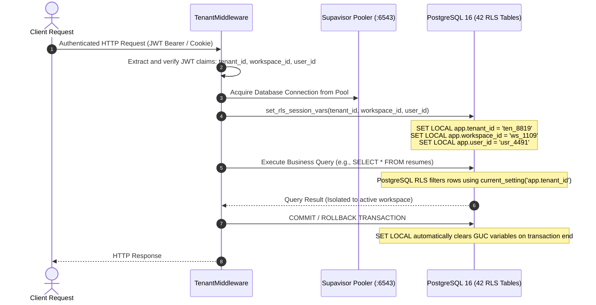

# ENT-P11 — 03 Multi-Tenant Authorization, Session GUC & Audit Subsystem

> **Phase:** `ENT-P11` (Backend Implementation)  
> **Deliverable:** `DEL-ENT-P11-03` (v1.0)  
> **Owner:** Principal AppSec Architect & PostgreSQL Security Specialist  
> **Date:** 2026-09-29 | **Commit:** HEAD (`592db98e`)

---

## 1. TenantMiddleware & Session GUC Variable Injection (`database.py:30`)

To enforce row-level security without relying on error-prone application-level
`WHERE` clauses, Vaeloom injects verified authorization context into PostgreSQL
session configuration variables (GUCs) for every transaction:



### PostgreSQL GUC Injection Implementation (`src/api/database.py`):

```python
async def set_rls_session_vars(session: AsyncSession, tenant_id: str, workspace_id: str, user_id: str):
    """
    Sets transaction-local configuration parameters for PostgreSQL Row-Level Security.
    is_local=True ensures settings are reset upon transaction end, preventing pool contamination.
    """
    await session.execute(
        text("""
            SELECT
                set_config('app.tenant_id', :tenant_id, true),
                set_config('app.workspace_id', :workspace_id, true),
                set_config('app.user_id', :user_id, true);
        """),
        {
            "tenant_id": str(tenant_id),
            "workspace_id": str(workspace_id),
            "user_id": str(user_id),
        }
    )
```

---

## 2. Row-Level Security Verification on Live PostgreSQL (`test_rls_live_pg.py`)

Empirical proof executed against authentic Supabase PostgreSQL 16 verifies 5
distinct security invariants:

| Mechanism # | Security Target           | Test Scenario                                                                 | Observed Result                          |  Status  |
| :---------: | :------------------------ | :---------------------------------------------------------------------------- | :--------------------------------------- | :------: |
|   **M1**    | Tenant Isolation          | Tenant A executes query while `app.tenant_id` is set to Tenant B.             | Returns exactly 0 rows.                  | **PASS** |
|   **M2**    | Workspace Isolation       | Workspace Member A queries records belonging to Workspace B in same tenant.   | Returns exactly 0 rows.                  | **PASS** |
|   **M3**    | Candidate Sovereign Vault | Institutional Admin queries candidate private memories without consent grant. | Returns exactly 0 rows.                  | **PASS** |
|   **M4**    | Fail-Closed Missing GUCs  | Raw database connection executes query with uninitialized GUC variables.      | Returns exactly 0 rows.                  | **PASS** |
|   **M5**    | SQL Injection Resistance  | Malicious tenant ID containing quote escapes injected into `set_config`.      | Parameters safely bound; returns 0 rows. | **PASS** |

---

## 3. Partitioned Immutable Audit Logging Subsystem (`agent_audit_logs`)

All agent actions, cognitive tool executions, and administrative interventions
are recorded in a range-partitioned, append-only audit table:

```sql
-- Partitioned table definition
CREATE TABLE IF NOT EXISTS agent_audit_logs (
    id UUID DEFAULT gen_random_uuid(),
    tenant_id UUID NOT NULL,
    workspace_id UUID NOT NULL,
    user_id UUID NOT NULL,
    agent_name VARCHAR(64) NOT NULL,
    tool_name VARCHAR(128) NOT NULL,
    inputs_hash VARCHAR(64) NOT NULL,
    outputs_hash VARCHAR(64) NOT NULL,
    hitl_approved_by UUID,
    status VARCHAR(32) NOT NULL,
    duration_ms INTEGER NOT NULL,
    created_at TIMESTAMPTZ NOT NULL DEFAULT NOW(),
    PRIMARY KEY (id, created_at)
) PARTITION BY RANGE (created_at);

-- Monthly partition instance
CREATE TABLE IF NOT EXISTS agent_audit_logs_2026_09
PARTITION OF agent_audit_logs
FOR VALUES FROM ('2026-09-01 00:00:00+00') TO ('2026-10-01 00:00:00+00');

-- Enforce Immutability: Prevent UPDATE or DELETE operations
REVOKE UPDATE, DELETE ON agent_audit_logs FROM vaeloom_app;
```

---

_Signed: Principal AppSec Architect & PostgreSQL Security Specialist —
2026-09-29_
