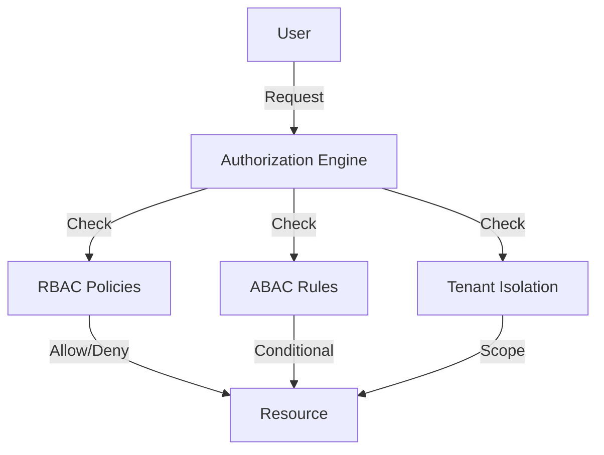

# Access Control Policy

> **Purpose:** Define the authorization model, permission architecture, and access control policies
> **Status:** ✅ Upgraded to enterprise quality
> **Owner:** Security Team
> **Version:** 2.0
> **Last Updated:** 2026-07-17

## Authorization Architecture

## Permission Model

| Level | Granularity | Example |
|---|---|---|
| Role-based (RBAC) | Coarse | `admin`, `member`, `viewer` |
| Attribute-based (ABAC) | Fine | `owner == userId`, `department == 'engineering'` |
| Resource-based | Per-resource | `memory:123:read`, `workspace:456:write` |
| Tenant-scoped | Tenant boundary | All resources scoped to tenant_id |

## Policy Definitions

| Policy | Effect | Condition |
|---|---|---|
| Admin full access | Allow | role == 'admin' |
| Member read workspace | Allow | role == 'member' && resource.type == 'workspace' && action == 'read' |
| Member write own memories | Allow | role == 'member' && resource.type == 'memory' && resource.userId == currentUser.id |
| Viewer read only | Allow | role == 'viewer' && action == 'read' |
| Cross-tenant access | Deny | Always (hard boundary) |
